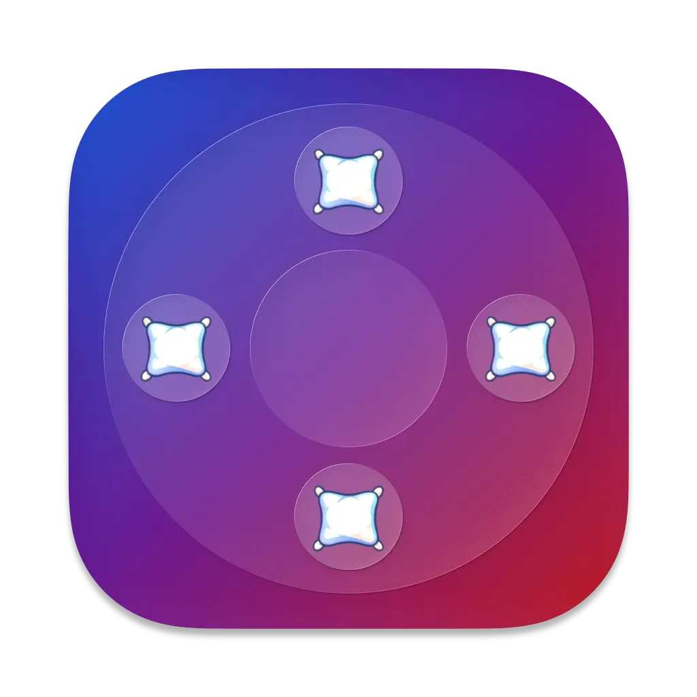

# ComfyTab

> Customizable App Switcher for macOS

## Install
- Requires **Xcode** (any recent version with Swift 6 support)
- Clone and open `ComfyTab.xcodeproj`
- Run the `ComfyTab` target

## Initialization Flow

```mermaid
%%{init: {
  "theme": "base",
  "themeVariables": {
    "actorBkg": "#1f2937",
    "actorBorder": "#9ca3af",
    "actorTextColor": "#e5e7eb",
    "activationBkgColor": "#374151",
    "activationBorderColor": "#9ca3af",
    "sequenceNumberColor": "#9ca3af",
    "signalTextColor": "#e5e7eb",
    "signalColor": "#9ca3af",
    "labelBoxBkgColor": "#111827",
    "labelBoxBorderColor": "#6b7280"
  }
}}%%
sequenceDiagram

    autonumber 1
 
    %% ==== Participants ====
    participant AD as AppDelegate
    participant AC as AppCoordinator
    participant ACP as AppCoordinator.prepare
    participant SM as SettingsManager
    participant RAM as RunningAppManager
    participant PM as PermissionManager
    participant IAM as InstalledAppManager

    participant OV as Overlay
    participant OVVM as OverlayViewModel
    participant OVP as Overlay.prepare

    participant HKM as HotKeyManager
    participant LM  as LocalMonitor
    participant HKPH as HotKeyManager.prepareHotKey()
    participant HKSP as HotKeyManager.setupPinningListener()
    participant HKSHC as HotKeyManager.setupHotKeyChangeListener()
    
    rect rgb(30,41,59)
        AD->>AC:     AppDelegate initializes AppCoordinator

        rect rgb(59,130,246)
            AC->>SM:     Initialize SettingsManager
            AC->>RAM:    Initialize RunningAppManager
            AC->>PM:     Initialize PermissionManager
            AC->>IAM:    Initialize InstalledAppManager
        end

        rect rgb(46,16,101)
            AC->>OV:     Initialize Overlay

            OV->>RAM:    Overlay Depends on RunningAppManager
            OV->>SM:     Overlay Depends on SettingsManager
            OV->>OVVM:   Overlay Creates OverlayViewModel

            OVVM->>RAM:  OverlayViewModel Depends on RunningAppManager
            OVVM->>SM:   OverlayViewModel Depends on SettingsManager
            OVP->>OV:    Overlay.prepare Called by Overlay
        end

        rect rgb(17,94,89)
            AC->>HKM:    Initialize HotKeyManager

            HKM->>SM:    HotKeyManager Depends on SettingsManager
            HKM->>OV:    HotKeyManager Depends on Overlay
            HKM->>OVVM:  HotKeyManager Depends on OverlayViewModel
            HKM->>LM:    HotKeyManager Initializes LocalMonitor
            
            HKM->>HKPH:  HotKeyManager.prepareHotKey() Called by HotKeyManager
            HKM->>HKSP:  HotKeyManager.setupPinningListener() Called by HotKeyManager
            HKM->>HKSHC: HotKeyManager.setupHotKeyChangeListener() Called by HotKeyManager
        end

        AD->>ACP:    AppDelegate calls AppCoordinator.prepare()
    end

```

